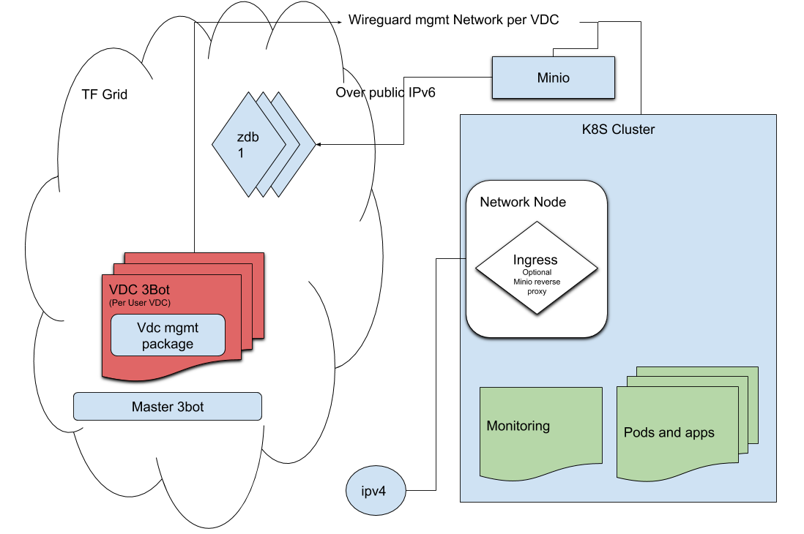

- A master 3 bot is able to create new Vdc's
- A 3bot per vdc is deployed
  - VDC website is a 3bot with vdc package installed
- VDC is (kubernetes + minio) in the same network
  - the vdc 3bot can reach the cluster over a wireguard mgmt network per vdc
  - cluster is exposed using edge network node from a farm providing public IPs 
  - monitoring runs in kubernetes
  - minio runs inside of the kubernetes cluster
  - on the Vdc website a user can choose to expose minio publicly
    - a reverse reverse proxy (in the cluster)  is then deployed in the cluster  exposed on the ingress

Using the existing authorisation, the user can be limited to the vdc website and not the other packages.  

- The vdc 3bot can
  - extend resources of the vdc when needed
  - scale out the zdbs once reaching a specific threshold maybe 70%
  - Deploy marketplace solutions in the cluster

